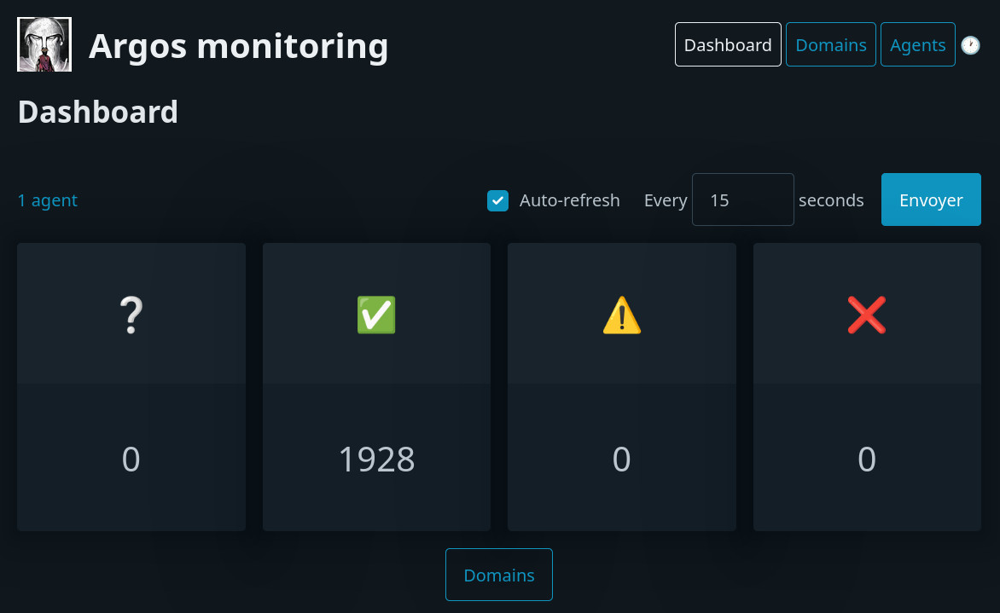

<!--
NOTA: Este README foi creado automáticamente por <https://github.com/YunoHost/apps/tree/master/tools/readme_generator>
NON debe editarse manualmente.
-->

# Argos para YunoHost

[](https://ci-apps.yunohost.org/ci/apps/argos/)


[](https://install-app.yunohost.org/?app=argos)

*[Le este README en outros idiomas.](./ALL_README.md)*

> *Este paquete permíteche instalar Argos de xeito rápido e doado nun servidor YunoHost.*  
> *Se non usas YunoHost, le a [documentación](https://yunohost.org/install) para saber como instalalo.*

## Vista xeral

A monitoring and status board for websites. Test how your websites respond to external checks, get notified when something goes wrong.

### Features

- Server-Agent architecture: The server is responsible for storing the configuration and the results of the checks. The agent is responsible for running the checks and sending the results to the server.
- Extensibility: New checks can be added using python.
- A Website allows to navigate the results of the checks.
- HTTP API: An HTTP API is exposed to get the results of the checks.


**Versión proporcionada:** 0.7.3~ynh1

## Capturas de pantalla



## Documentación e recursos

- Web oficial da app: <https://argos-monitoring.framasoft.org/#>
- Documentación oficial para admin: <https://argos-monitoring.framasoft.org/>
- Repositorio de orixe do código: <https://framagit.org/framasoft/framaspace/argos/>
- Tenda YunoHost: <https://apps.yunohost.org/app/argos>
- Informar dun problema: <https://github.com/YunoHost-Apps/argos_ynh/issues>

## Info de desenvolvemento

Envía a túa colaboración á [rama `testing`](https://github.com/YunoHost-Apps/argos_ynh/tree/testing).

Para probar a rama `testing`, procede deste xeito:

```bash
sudo yunohost app install https://github.com/YunoHost-Apps/argos_ynh/tree/testing --debug
ou
sudo yunohost app upgrade argos -u https://github.com/YunoHost-Apps/argos_ynh/tree/testing --debug
```

**Máis info sobre o empaquetado da app:** <https://yunohost.org/packaging_apps>
