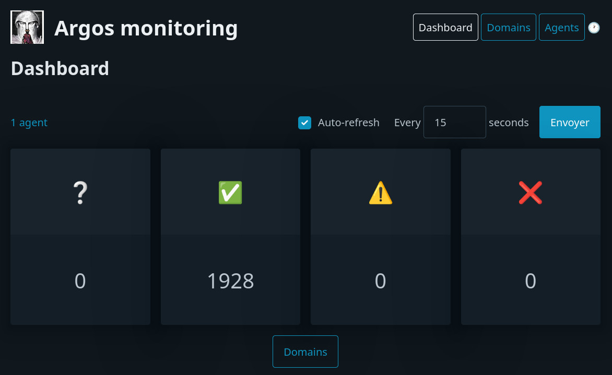

<!--
To README zostało automatycznie wygenerowane przez <https://github.com/YunoHost/apps/tree/master/tools/readme_generator>
Nie powinno być ono edytowane ręcznie.
-->

# Argos dla YunoHost

[](https://ci-apps.yunohost.org/ci/apps/argos/)


[](https://install-app.yunohost.org/?app=argos)

*[Przeczytaj plik README w innym języku.](./ALL_README.md)*

> *Ta aplikacja pozwala na szybką i prostą instalację Argos na serwerze YunoHost.*  
> *Jeżeli nie masz YunoHost zapoznaj się z [poradnikiem](https://yunohost.org/install) instalacji.*

## Przegląd

A monitoring and status board for websites. Test how your websites respond to external checks, get notified when something goes wrong.

### Features

- Server-Agent architecture: The server is responsible for storing the configuration and the results of the checks. The agent is responsible for running the checks and sending the results to the server.
- Extensibility: New checks can be added using python.
- A Website allows to navigate the results of the checks.
- HTTP API: An HTTP API is exposed to get the results of the checks.


**Dostarczona wersja:** 0.7.3~ynh1

## Zrzuty ekranu



## Dokumentacja i zasoby

- Oficjalna strona aplikacji: <https://argos-monitoring.framasoft.org/#>
- Oficjalna dokumentacja dla administratora: <https://argos-monitoring.framasoft.org/>
- Repozytorium z kodem źródłowym: <https://framagit.org/framasoft/framaspace/argos/>
- Sklep YunoHost: <https://apps.yunohost.org/app/argos>
- Zgłaszanie błędów: <https://github.com/YunoHost-Apps/argos_ynh/issues>

## Informacje od twórców

Wyślij swój pull request do [gałęzi `testing`](https://github.com/YunoHost-Apps/argos_ynh/tree/testing).

Aby wypróbować gałąź `testing` postępuj zgodnie z instrukcjami:

```bash
sudo yunohost app install https://github.com/YunoHost-Apps/argos_ynh/tree/testing --debug
lub
sudo yunohost app upgrade argos -u https://github.com/YunoHost-Apps/argos_ynh/tree/testing --debug
```

**Więcej informacji o tworzeniu paczek aplikacji:** <https://yunohost.org/packaging_apps>
